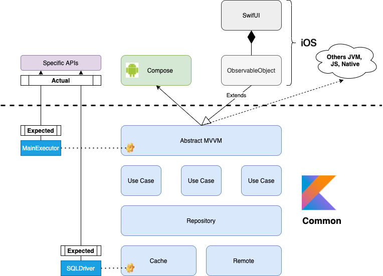

# KMM-Movie-App

## Tech-stack

* Tech-stack
    * [Kotlin](https://kotlinlang.org/) - a cross-platform, statically typed, general-purpose programming language with type inference.
    * [Kotlin Multiplatform Mobile (KMM)](https://kotlinlang.org/docs/kmm-overview.html) - an SDK designed to simplify creating cross-platform mobile applications.
    * [Coroutines](https://kotlinlang.org/docs/reference/coroutines-overview.html) - perform background operations.
    * [Flow](https://kotlinlang.org/docs/reference/coroutines/flow.html) - handle the stream of data asynchronously that executes sequentially.
    * [Koin](https://insert-koin.io/) - A pragmatic and lightweight dependency injection framework.
    * [ktor](https://ktor.io/) - is a framework to easily build connected applications – web applications, HTTP services, mobile and browser applications.
    * [SQLDelight](https://cashapp.github.io/sqldelight/) - Generates typesafe Kotlin APIs from SQL
    * [Jetpack](https://developer.android.com/jetpack)
        * [Lifecycle](https://developer.android.com/topic/libraries/architecture/lifecycle) - perform action when lifecycle state changes.
        * [ViewModel](https://developer.android.com/topic/libraries/architecture/viewmodel) - store and manage UI-related data in a lifecycle conscious way.
## Architecture

## Todos
- [] Implement caching using SQLDelight
- [] Write UTs and UI tests
- [] Implement IOS version using SwiftUI  (will be done when I get a MacBook)
- [] Publish on Playstore